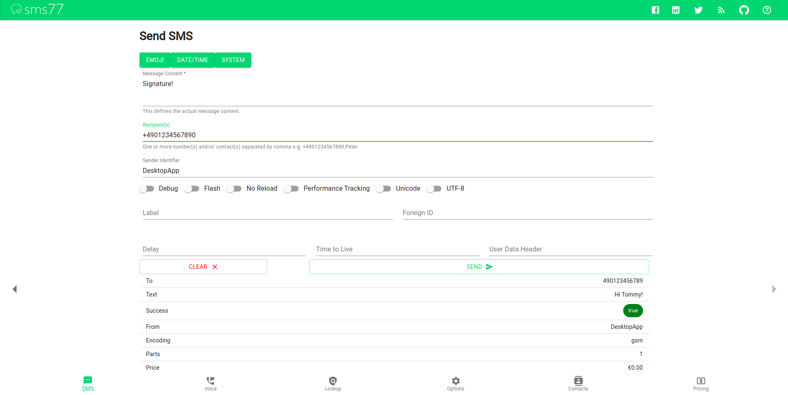
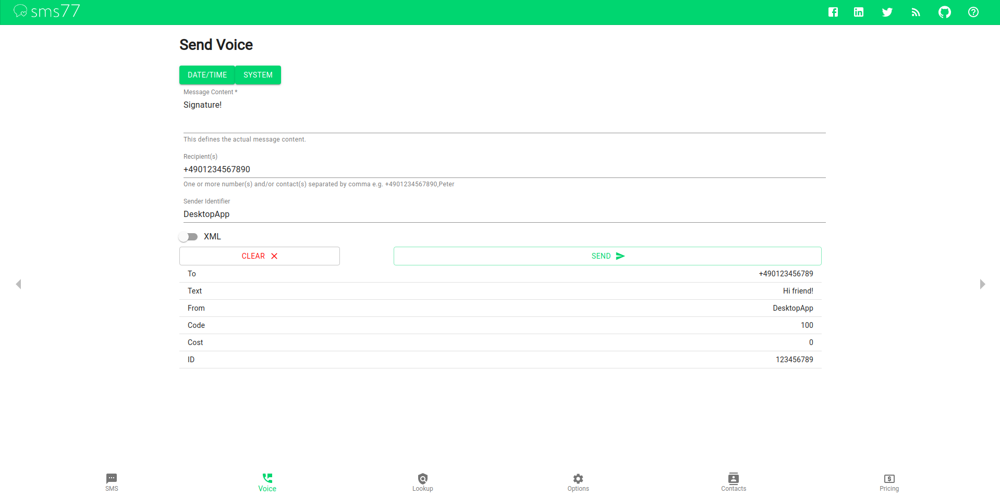
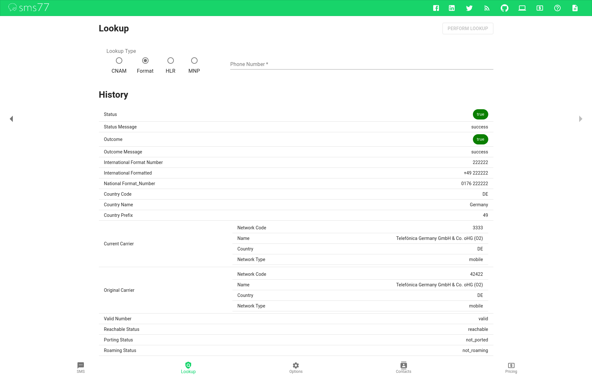
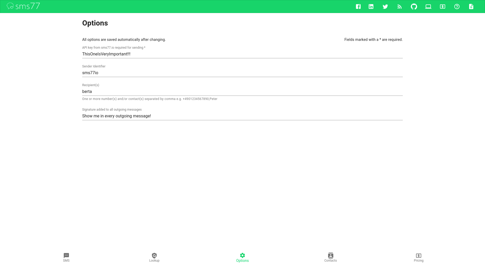
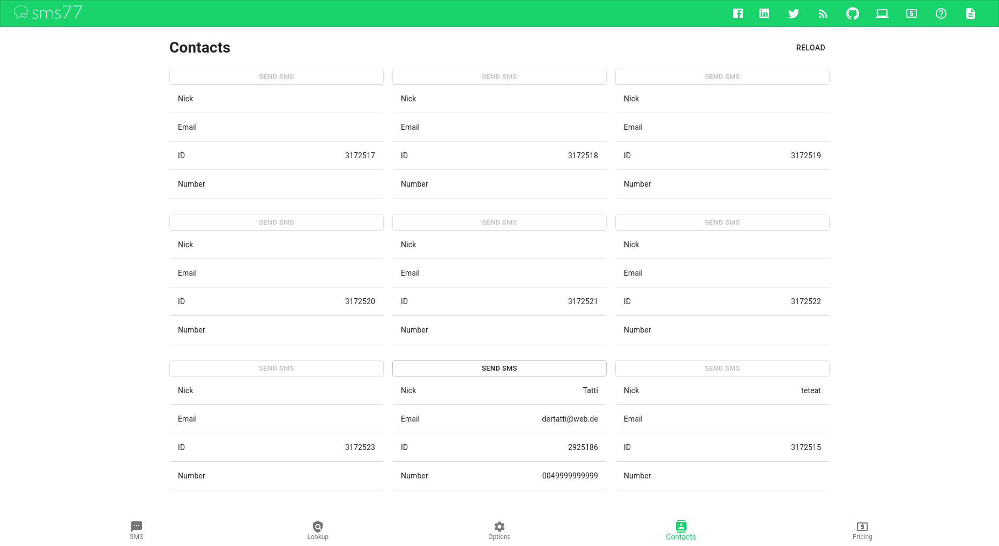
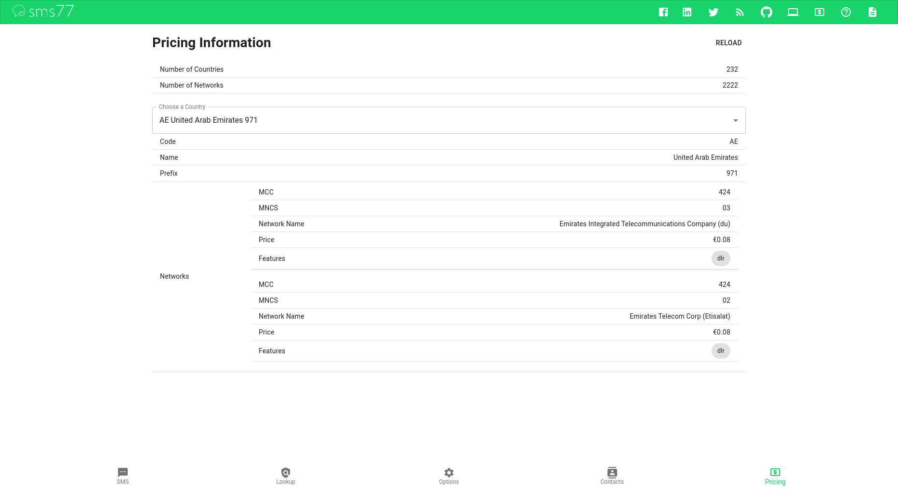

# sms77io Desktop Application

Distributed for Linux, MacOS and Windows.

## Installation
Head to /releases and download the latest installer for your operating system.
Follow the installer instructions to install the application on your disk.

You can alternatively clone the project 
and build the application yourself by running ```npm install``` and ```npm run make```.
Make sure you have NodeJS installed.

### Features
- Send SMS to one/multiple user(s)
- Send Text2Speech messages
- Message utilities: emojis, date/time, system-related
- Message history
- Number lookups: CNAM, HLR, MNP, format
- Lookup history
- Retrieve pricing
- Read contacts

##### Screenshots
SMS


Voice


Lookup Number


Options


Contacts


Pricing
